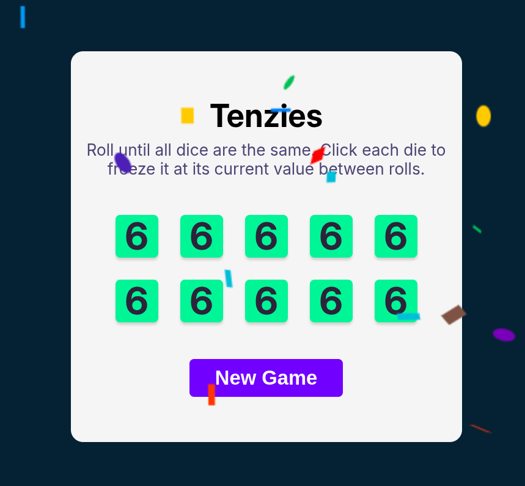

# Tenzies Game

This is a simple Tenzies game built with React. The objective of the game is to roll the dice until all of them show the same value. You can click on each die to freeze it at its current value between rolls.

## How to Play

1. Roll the dice by clicking the "Roll" button.
2. Click on a die to hold its value.
3. Continue rolling until all dice show the same value.
4. When all dice are the same, you win! Click "New Game" to start over.

## Features

- Roll the dice to get random values.
- Click on a die to hold its value.
- Confetti animation when you win the game.
- Start a new game with the "New Game" button.

## Screenshot



## Installation

1. Clone the repository:
    ```sh
    git clone https://github.com/HariMalam/tenzies
    ```
2. Navigate to the project directory:
    ```sh
    cd tenzies-game
    ```
3. Install the dependencies:
    ```sh
    npm install
    ```
4. Start the development server:
    ```sh
    npm run dev
    ```


## License

This project is licensed under the MIT License.